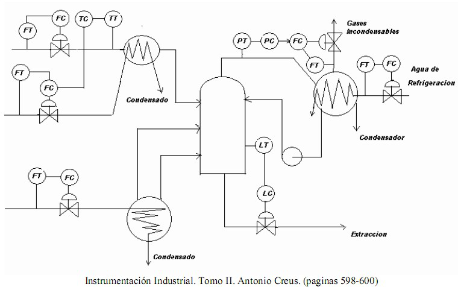
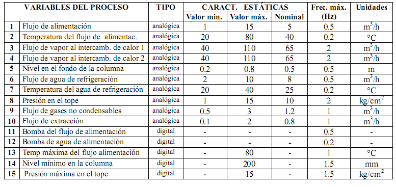

# Variante 55. Columna de destilación

> Tareas a realizar: [00-tareas-generales.md](00-tareas-generales.md)

Referencia: *Instrumentación Industrial*, Tomo II, Antonio Creus (páginas 598-600).

## Variables del proceso

| # | Variable del proceso | Tipo | Valor mín. | Valor máx. | Nominal | Frec. máx. (Hz) | Unidades |
|---|---|---|---|---|---|---|---|
| 1 | Flujo de alimentación | analógica | 1 | 15 | 5 | 0.5 | m³/h |
| 2 | Temperatura del flujo de alimentac. | analógica | 20 | 80 | 40 | 0.2 | °C |
| 3 | Flujo de vapor al intercamb. de calor 1 | analógica | 40 | 110 | 65 | 2 | m³/h |
| 4 | Flujo de vapor al intercamb. de calor 2 | analógica | 40 | 110 | 65 | 2 | m³/h |
| 5 | Nivel en el fondo de la columna | analógica | 0.2 | 0.8 | 0.5 | 0.5 | m |
| 6 | Flujo de agua de refrigeración | analógica | 2 | 10 | 8 | 0.5 | m³/h |
| 7 | Temperatura del agua de refrigeración | analógica | 20 | 40 | 25 | 0.2 | °C |
| 8 | Presión en el tope | analógica | 1 | 15 | 10 | 2 | kg/cm² |
| 9 | Flujo de gases no condensables | analógica | 0.5 | 3 | 1.2 | 1 | m³/h |
| 10 | Flujo de extracción | analógica | 0.1 | 2 | 0.8 | 1 | m³/h |
| 11 | Bomba del flujo de alimentación | digital | – | – | – | 0.5 | – |
| 12 | Bomba de agua de alimentación | digital | – | – | – | 0.2 | – |
| 13 | Temp. máxima del flujo alimentación | digital | – | 80 | – | 1 | °C |
| 14 | Nivel mínimo en la columna | digital | – | 200 | – | 1.5 | mm |
| 15 | Presión máxima en el tope | digital | – | 15 | – | 1.5 | kg/cm² |

## Requisitos adicionales

Seleccionar sistema de mando para el motor de la bomba y elegir límites para las variables analógicas, mantener una.
