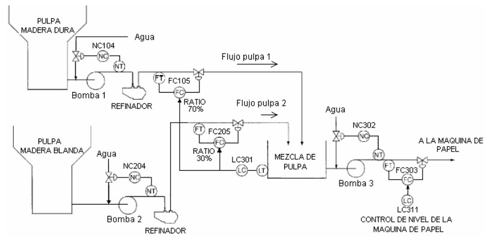
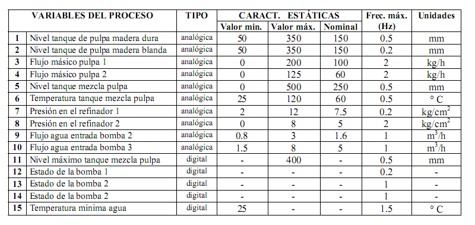

# Variante 56. Fabricación de pulpa de papel

> Página 59 del PDF original (variante 58 en el documento original). Tareas a realizar: [00-tareas-generales.md](00-tareas-generales.md)

## Variables del proceso

| # | Variable del proceso | Tipo | Valor mín. | Valor máx. | Nominal | Frec. máx. (Hz) | Unidades |
|---|---|---|---|---|---|---|---|
| 1 | Nivel tanque de pulpa madera dura | analógica | 50 | 350 | 150 | 0.5 | mm |
| 2 | Nivel tanque de pulpa madera blanda | analógica | 50 | 350 | 150 | 0.2 | mm |
| 3 | Flujo másico pulpa 1 | analógica | 0 | 200 | 100 | 2 | kg/h |
| 4 | Flujo másico pulpa 2 | analógica | 0 | 125 | 60 | 2 | kg/h |
| 5 | Nivel tanque mezcla pulpa | analógica | 0 | 500 | 250 | 0.5 | mm |
| 6 | Temperatura tanque mezcla pulpa | analógica | 25 | 120 | 60 | 0.5 | °C |
| 7 | Presión en el refinador 1 | analógica | 2 | 12 | 7.5 | 0.2 | kg/cm² |
| 8 | Presión en el refinador 2 | analógica | 0 | 8 | 5 | 2 | kg/cm² |
| 9 | Flujo agua entrada bomba 2 | analógica | 0.8 | 3 | 1.6 | 1 | m³/h |
| 10 | Flujo agua entrada bomba 3 | analógica | 1.5 | 8 | 5 | 1 | m³/h |
| 11 | Nivel máximo tanque mezcla pulpa | digital | – | 400 | – | 0.5 | mm |
| 12 | Estado de la bomba 1 | digital | – | – | – | 0.2 | – |
| 13 | Estado de la bomba 2 | digital | – | – | – | 1 | – |
| 14 | Estado de la bomba 2 | digital | – | – | – | 1 | – |
| 15 | Temperatura mínima agua | digital | 25 | – | – | 1.5 | °C |

> Nota: las filas 13 y 14 aparecen ambas como "Estado de la bomba 2" en el documento original; probablemente la 14 debería ser la bomba 3.

## Requisitos adicionales

Seleccionar sistema de mando para el motor de las bombas y elegir límites para las variables analógicas, mantener una.
