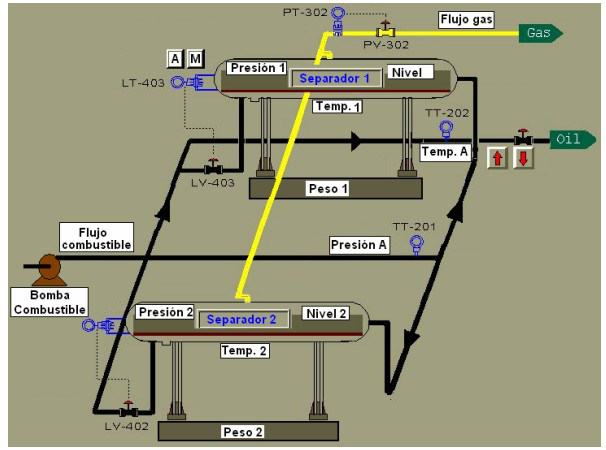
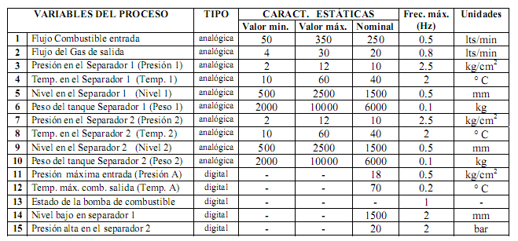

# Variante 57. Separación de gas

> Página 60 del PDF original (variante 59 en el documento original). Tareas a realizar: [00-tareas-generales.md](00-tareas-generales.md)

## Variables del proceso

| # | Variable del proceso | Tipo | Valor mín. | Valor máx. | Nominal | Frec. máx. (Hz) | Unidades |
|---|---|---|---|---|---|---|---|
| 1 | Flujo combustible entrada | analógica | 50 | 350 | 250 | 0.5 | lts/min |
| 2 | Flujo del gas de salida | analógica | 4 | 30 | 20 | 0.8 | lts/min |
| 3 | Presión en el separador 1 (Presión 1) | analógica | 2 | 12 | 10 | 2.5 | kg/cm² |
| 4 | Temp. en el separador 1 (Temp. 1) | analógica | 10 | 60 | 40 | 2 | °C |
| 5 | Nivel en el separador 1 (Nivel 1) | analógica | 500 | 2500 | 1500 | 0.5 | mm |
| 6 | Peso del tanque separador 1 (Peso 1) | analógica | 2000 | 10000 | 6000 | 0.1 | kg |
| 7 | Presión en el separador 2 (Presión 2) | analógica | 2 | 12 | 10 | 2.5 | kg/cm² |
| 8 | Temp. en el separador 2 (Temp. 2) | analógica | 10 | 60 | 40 | 2 | °C |
| 9 | Nivel en el separador 2 (Nivel 2) | analógica | 500 | 2500 | 1500 | 0.5 | mm |
| 10 | Peso del tanque separador 2 (Peso 2) | analógica | 2000 | 10000 | 6000 | 0.1 | kg |
| 11 | Presión máxima entrada (Presión A) | digital | – | – | 18 | 0.5 | kg/cm² |
| 12 | Temp. máx. comb. salida (Temp. A) | digital | – | – | 70 | 0.2 | °C |
| 13 | Estado de la bomba de combustible | digital | – | – | – | 1 | – |
| 14 | Nivel bajo en separador 1 | digital | – | – | 1500 | 2 | mm |
| 15 | Presión alta en el separador 2 | digital | – | – | 20 | 2 | bar |

## Requisitos adicionales

Seleccionar sistema de mando para el motor de las bombas y elegir límites para las variables analógicas, mantener una.
