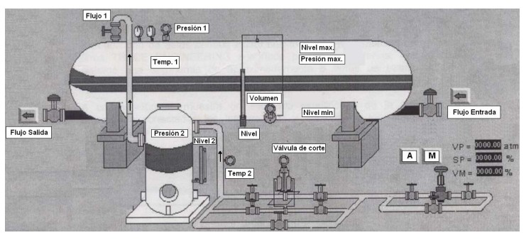
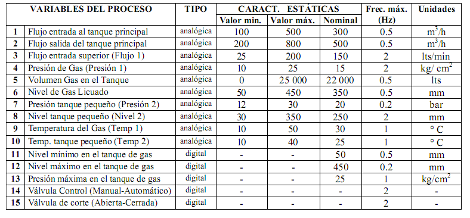

# Variante 58. Tanque de almacenamiento de propano

> Página 61 del PDF original (variante 60 en el documento original). Tareas a realizar: [00-tareas-generales.md](00-tareas-generales.md)

## Variables del proceso

| # | Variable del proceso | Tipo | Valor mín. | Valor máx. | Nominal | Frec. máx. (Hz) | Unidades |
|---|---|---|---|---|---|---|---|
| 1 | Flujo entrada al tanque principal | analógica | 100 | 500 | 300 | 0.5 | m³/h |
| 2 | Flujo salida del tanque principal | analógica | 200 | 800 | 500 | 0.5 | m³/h |
| 3 | Flujo entrada superior (Flujo 1) | analógica | 25 | 200 | 150 | 2 | lts/min |
| 4 | Presión de gas (Presión 1) | analógica | 10 | 25 | 15 | 2 | kg/cm² |
| 5 | Volumen gas en el tanque | analógica | 0 | 25 000 | 22 000 | 0.5 | lts |
| 6 | Nivel de gas licuado | analógica | 50 | 450 | 350 | 0.5 | mm |
| 7 | Presión tanque pequeño (Presión 2) | analógica | 12 | 30 | 20 | 0.2 | bar |
| 8 | Nivel tanque pequeño (Nivel 2) | analógica | 30 | 350 | 250 | 2 | mm |
| 9 | Temperatura del gas (Temp 1) | analógica | 10 | 50 | 30 | 1 | °C |
| 10 | Temp. tanque pequeño (Temp 2) | analógica | 10 | 40 | 25 | 1 | °C |
| 11 | Nivel mínimo en el tanque de gas | digital | – | – | 50 | 0.5 | mm |
| 12 | Nivel máximo en el tanque de gas | digital | – | – | 450 | 0.2 | mm |
| 13 | Presión máxima en el tanque de gas | digital | – | – | 25 | 1 | kg/cm² |
| 14 | Válvula control (manual-automático) | digital | – | – | – | 2 | – |
| 15 | Válvula de corte (abierta-cerrada) | digital | – | – | – | 2 | – |

## Requisitos adicionales

Seleccionar sistema de mando para el motor de las bombas y elegir límites para las variables analógicas, mantener una.
