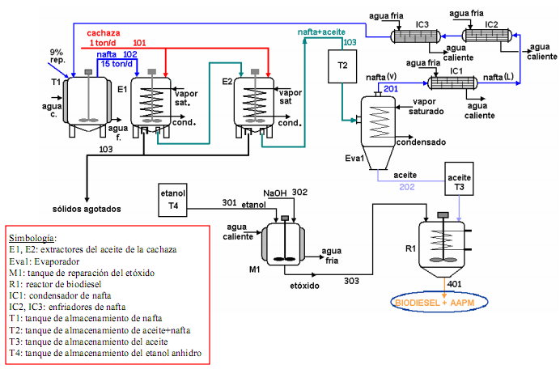

# Variante 59. Obtención del biodiesel a partir de la cachaza (dos estudiantes)

> Página 62 del PDF original (variante 61 en el documento original). Tareas a realizar: [00-tareas-generales.md](00-tareas-generales.md)

Simbología de la figura:

- **E1, E2:** extractores del aceite de la cachaza
- **Eva1:** evaporador
- **M1:** tanque de preparación del etóxido
- **R1:** reactor de biodiesel
- **IC1:** condensador de nafta
- **IC2, IC3:** enfriadores de nafta
- **T1:** tanque de almacenamiento de nafta
- **T2:** tanque de almacenamiento de aceite+nafta
- **T3:** tanque de almacenamiento del aceite
- **T4:** tanque de almacenamiento del etanol anhidro

## Requisitos adicionales

Seleccionar sistema de mando para el motor de las bombas y elegir límites para las variables analógicas, mantener una.

Ver trabajo de diploma de la UCLV, título: "Estudio y diseño de una Planta Demostrativa para la producción de Biodiesel a partir de un residuo de la Industria Azucarera".

- Autor: Reinier Feyt Leyva
- Tutora: Dra. Gretel Villanueva Ramos
