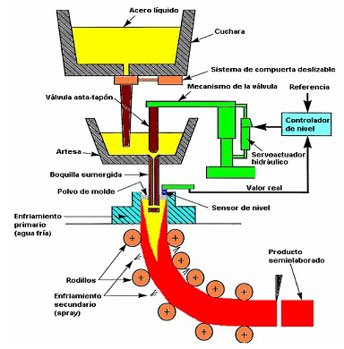

# Variante 61. Vaciado continuo de acero. ACINOX-Tunas

> Páginas 62–63 del PDF original (variante 62 (bis) en el documento original). Tareas a realizar: [00-tareas-generales.md](00-tareas-generales.md)
>
> Atención: el documento original numera esta variante también como 62, duplicando el número con la prensa hidráulica ([variante 60](variante-60-prensa-hidraulica.md)); aquí se han separado en dos variantes con numeración secuencial propia.

## Descripción del proceso

Como se muestra en la figura, el acero líquido procedente de la cuchara o cazuela se vacía en un recipiente llamado artesa, de donde pasa a un molde de sección rectangular tras la actuación de una válvula del tipo asta-tapón, atravesando luego una boquilla sumergida. Esta boquilla tiene como función proteger el chorro de acero, evitar que se oxide y evitar también en lo posible la captura de polvos de lubricación o impurezas que degradarían la calidad del producto.

La válvula asta-tapón, accionada por un actuador hidráulico, permite regular el flujo de acero entrante en el molde. El nivel se debe mantener en una posición fija durante la colada, para permitir una óptima extracción de calor del molde de modo que se genere la piel del desbaste, y que ésta tenga el suficiente espesor a la salida del molde como para soportar en su interior la vena líquida sin quebrarse.

El acero en estado semisólido se extrae del molde por tracción con la ayuda de un conjunto de rodillos motorizados a través de los cuales se establece la velocidad de vaciado de la máquina. En un inicio, el acero se agarra a la cabeza de una falsa barra que sella la parte inferior del molde. Simultáneamente se produce la refrigeración secundaria mediante chorros de agua atomizada con aire a presión, hasta que se completa la solidificación de la vena líquida. Finalmente llega a la zona de corte, donde se corta en planchones o palanquillas de la longitud deseada.

Se debe utilizar el control de nivel para seleccionar la producción deseada.

