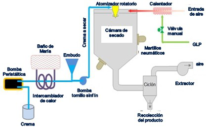

# Variante 62. Secador biotecnología

> Página 63 del PDF original (variante 63 en el documento original). Tareas a realizar: [00-tareas-generales.md](00-tareas-generales.md)
>
> El documento original presenta esta variante únicamente mediante la figura; no incluye texto descriptivo.

